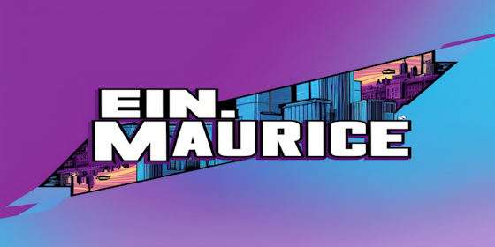

# 💫 About Me:
🎉 ➜ Born on August 15, 2008 🏫 ➜ Currently attending the City of Cologne Vocational College Südstadt 🔧 ➜ Currently learning Java and web development 🤙 ➜ In my free time, I enjoy meeting friends

## 🌐 Socials:
    

# 💻 Tech Stack:
             
# 📊 GitHub Stats:
 
 

---

<picture>
  <source media="(prefers-color-scheme: dark)" srcset="https://raw.githubusercontent.com/einmaurice/einmaurice/output/github-snake-dark.svg" />
  <source media="(prefers-color-scheme: light)" srcset="https://raw.githubusercontent.com/einmaurice/einmaurice/output/github-snake.svg" />
  
</picture>

<!-- Proudly created with GPRM ( https://gprm.itsvg.in ) -->
